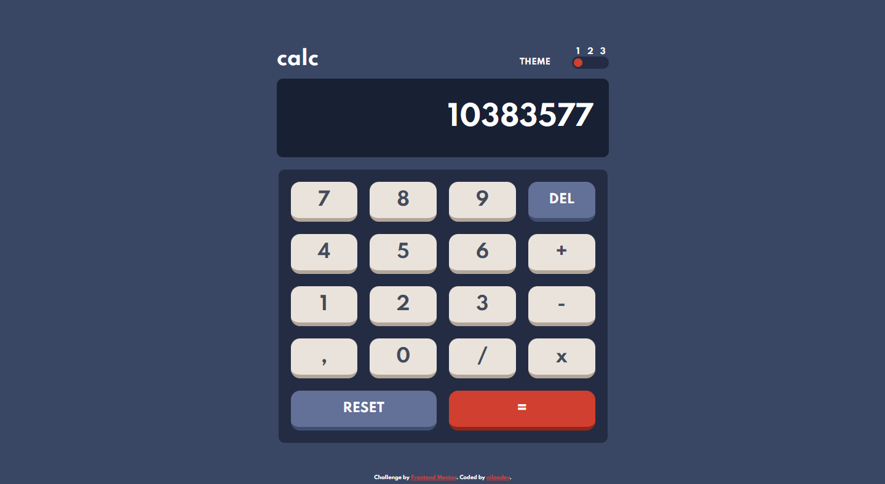
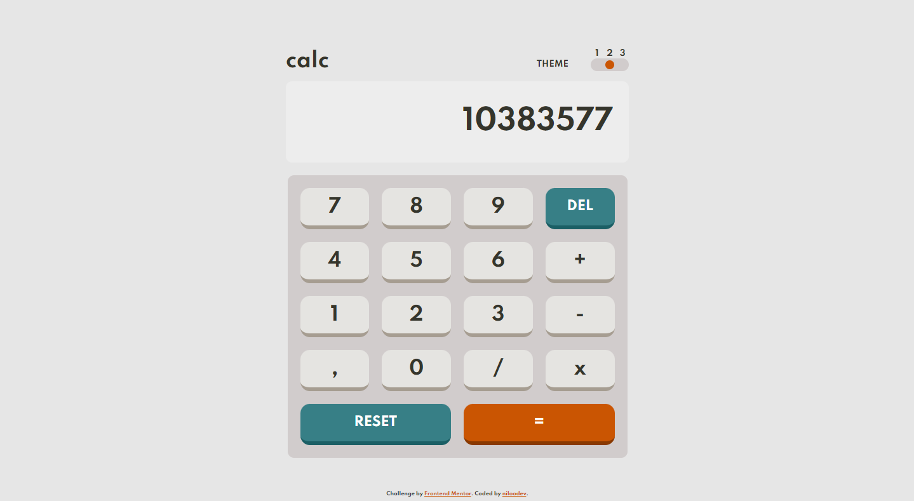
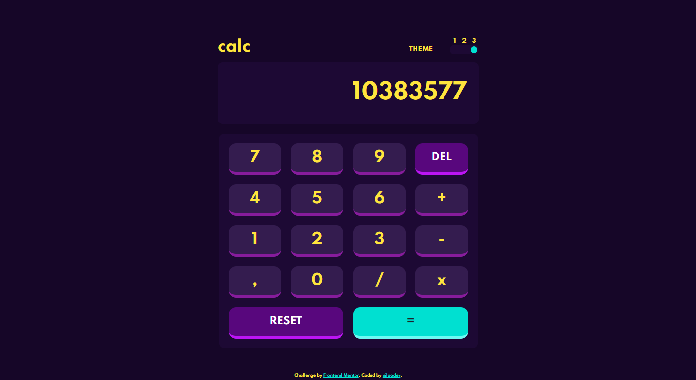

# FRONTEND MENTOR - SOLUÇÃO DO DESAFIO DA CALCULADORA

Essa é uma das soluções para o [Desafio da Calculadora do Frontend Mentor](https://www.frontendmentor.io/challenges/calculator-app-9lteq5N29).

## SUMÁRIO

- [RESUMO](#overview)
  - [DESAFIO](#the-challenge)
  - [IMAGENS](#screenshot)
- [PROCESSO](#my-process)
  - [FERRAMENTAS UTILIZADAS](#built-with)
- [AUTOR | CRÉDITOS](#author)

## RESUMO
Foi um desafio relativamente fácil de fazer, não utilizei nenhuma framework ou biblioteca em especial; construindo o código inteiro no puro HTML, CSS e JS.

### DESAFIO

O desafio é simples, você deve construir uma calculadora que se assimile ao design apresentado.

Você pode utilizar as ferramentas que quiser para completar o desafio.

Os usuários precisam conseguir:

- Ver os elementos na tela a partir da resolução do dispositivo sem distorções (**responsividade**).
- Performar operações matemáticas básicas como: multiplicação, divisão, subtração e adição.
- Ter a capacidade de escolher um dos temas da página dinamicamente.
- **Bônus**: Ter o último tema escolhido guardado dentro do navegador como `prefers-color-scheme`.

### IMAGENS | PRINTS

Tema azul, ou número 1.

Tema branco, ou número 2.

Tema roxo, ou número 3.

## PROCESSO
Eu comecei criando uma div "main" para realizar testes de responsividade, criando a estrutura da página - como a tela, o teclado, os botões, o cabeçalho, o **input** dos temas.
Logo após fui para estilização, criei as varíaveis com as cores de cada tema (disponibilizado pelo desafio) e separei elas; meu plano desde o começo era trocar a classe da tag "body" e organizar os estilos pelas classes respectivas aos temas, assim possibilitando uma troca simples de realizar em JS e uma transição suave das cores com o "transition" do CSS. (visto que optei por não utilizar nenhuma outra ferramenta complexa - vulgo React ou SASS - e fiz tudo com HTML, CSS e JS puro).
Em suma, finalizei o projeto criando um sistema básico de calculadora funcional com o design proposto - tive que corrigir alguns pequenos bugs para o resultado final.

### FERRAMENTAS

- HTML básico.
- Variáveis de CSS.
- Flexbox (CSS) | decidi destacar essa já que é ESSENCIAL para fazer uma página responsiva.
- Fonte ["Spartan do Google Fonts"](https://fonts.googleapis.com/css2?family=Spartan:wght@700&display=swap)

## AUTOR | CRÉDITOS
**Feito por niloodev | Ezequiel Nilo**

**QUALQUER DICA OU FEEDBACK É ALTAMENTE APRECIADO! 🐸**